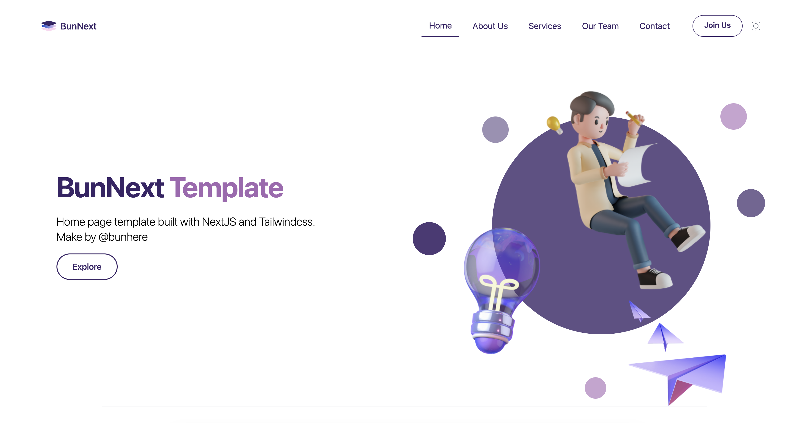

# BunNext - Landing page Template

<p>
<a href="#"></a>
<a href="#"></a>
<a href="#">14-black?logo=next.js" alt="Build Status"></a>
<a href="#"></a>
</p>

This is a [Next.js](https://nextjs.org/) and TailwindCSS project template create by [Bun(@bunhere)](https://bunhere.com/)



## Quick Started

Run the development server:

```bash
yarn dev
```

Open [http://localhost:3000](http://localhost:3000) with your browser to see the result.

## Custom

### Theme Colors

Change the color of the theme in `tailwind.config.js`.

Light mode | Dark mode
-----------|-----------
`main`     | `main-dark`
`sub`      | `sub-dark`

### Contact Form

Reference: [Web3Form](https://web3forms.com/)

Update the `.env` file for the `NEXT_PUBLIC_WEB3FORM_ACCESS_KEY` value with [Web3Form Document](https://docs.web3forms.com/).
